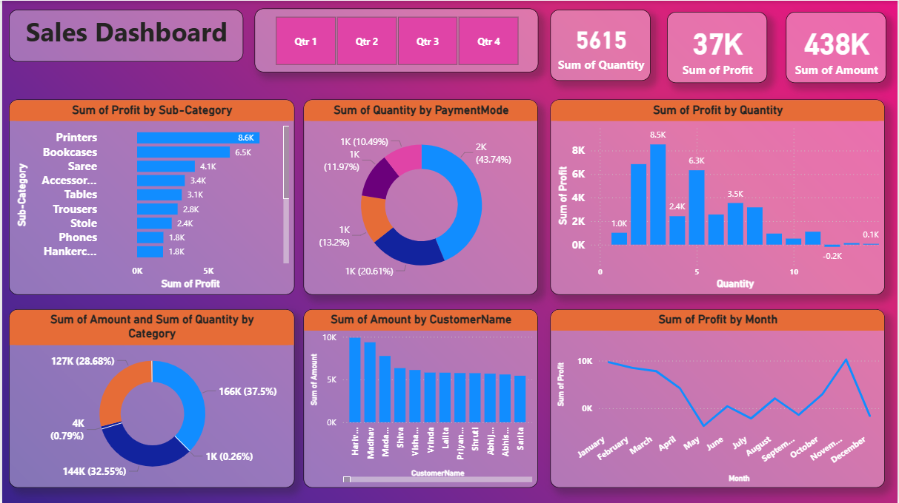

# 📊 Sales Dashboard

## 📌 Overview

This project is an interactive **Sales Dashboard** built to analyze and visualize sales performance. The dashboard provides insights into **profit, sales amount, quantity sold, payment modes, customer contributions, and monthly trends**.

The purpose of this dashboard is to help businesses track key performance indicators (KPIs) and make **data-driven decisions**.

---

## ⚡ Key Features

* ✅ **KPIs at a glance** – Total Quantity, Profit, and Amount
* ✅ **Profit by Sub-Category** – Identify top & low-performing product lines
* ✅ **Quantity by Payment Mode** – Breakdown of transactions by payment methods
* ✅ **Profit by Quantity** – Profit contribution across sales quantities
* ✅ **Sales & Profit Trends** – Month-wise performance tracking
* ✅ **Customer Contribution** – Sales distribution across customers
* ✅ **Category-Wise Analysis** – Quantity vs Amount distribution

---

## 🛠️ Tech Stack

* **Tool:** Power BI (or Tableau / Excel, based on your implementation)
* **Data Source:** Sales transaction dataset (CSV/Excel/SQL database)
* **Visualization:** Interactive charts & graphs

---

## 📂 Project Structure

```
sales-dashboard/
│── data/                # Raw and cleaned dataset files
│── dashboard/           # Power BI / Tableau file
│── images/              # Screenshots of the dashboard
│── README.md            # Project documentation
```

---

## 🚀 Getting Started

1. Clone the repository:

   ```bash
   git clone https://github.com/your-username/sales-dashboard.git
   ```
2. Navigate to the project folder:

   ```bash
   cd sales-dashboard
   ```
3. Open the dashboard file in **Power BI / Tableau / Excel**.
4. Explore insights with interactive filters (Quarter, Category, Sub-Category, Customer).

---

## 📸 Dashboard Preview



---

## 📊 Insights from the Dashboard

* **Printers** generate the highest profit (\~8.6K).
* Most sales happen through one dominant **payment mode (\~44%)**.
* Profit fluctuates across months, peaking in **December (\~10K)**.
* Top customers include **Ajit, Madhav, Madan, and Nidhi**.
* Sales categories are unevenly distributed, with **one category contributing 37.5%** of total sales.

---

## 🤝 Contribution

Contributions are welcome!

* Fork the repo
* Create a new branch (`feature-new-insight`)
* Commit your changes
* Open a Pull Request

---

## 📜 License

This project is licensed under the **MIT License** – feel free to use and modify.

---

✨ Developed with passion for **data visualization & analytics**
